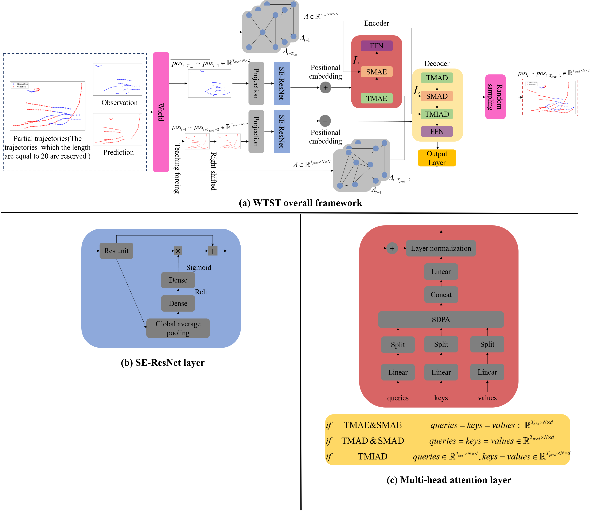
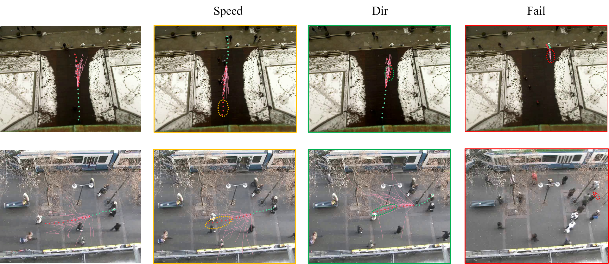
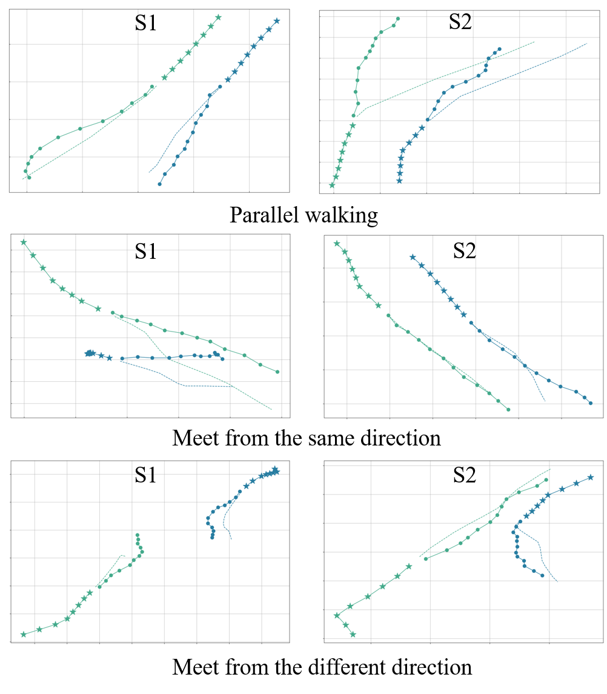

# WTST
Pedestrians trajectory prediction-Tensorflow  Implementation
## Contents

- [Background](#background)
- [Preliminary](#preliminary)
	- [Dataset](#dataset)
	- [Weight](#weight)
- [Training](#training)
- [Results](#results)
- [Contributing](#contributing)
- [License](#license)

## Background

As a perception algorithm, trajectory prediction algorithm plays an important role in autonomous
driving and monitoring systems. Accurately predicting pedestrian movement information in
the future can effectively ensure pedestrian traffic safety and reduce the risk of infrastructure.
We propose a novel pedestrian trajectory prediction model based on Transformer framework
called WTST aiming to solve the challenges of multi-agent, dynamic, partially observable and
stochastic when it comes to pedestrian trajectory prediction. For the partially observable, a world
module including frame padding and trajectory padding, the data input to the network is all
pedestrians in the scene, not partial pedestrians whose trajectories only meet the length requirement.
For the dynamic, the temporal multi-head attention(TMAE&TMAD) and the temporal
multi-head interactive attention(TMIAD) are used to model motion characteristics of pedestrians
in the temporal dimension. For the multi-agent, social multi-head attention(SMAE&SMAD)
combined with dynamic graphs is adopted to capture the social behavior of all pedestrians in
the scene at each moment. For the stochastic, WTST employs bi-variate Gaussian distribution
to sample the potential paths of pedestrians. The WTST consists of embedding layer, encoder
layers, decoder layers and output layer. The embedding layer performs attention encoding for
SE-ResNet in both temporal and social dimensions. The encoder and decoder layers include
attention layers and feed forward layers, and masking techniques are introduced to eliminate
the effect of world padding. The output layer outputs the parameter information required by
the bi-variate Gaussian distribution through dimension transformation.Finally, the WTST and
baseline model are extensively experimented on the benchmark, and the overall performance of
WTST is improved by 13.16% and 13.70%. Ablation experiments find that the world module
improves performance slightly, while temporal modeling and social modeling have a significant
impact on prediction performance. Quantitative analysis shows that the masking technique can
weaken the motion tendency of stopping pedestrians to a certain extent. In addition, WTST can
give a plausible result for predicting pedestrian interaction behavior. Benefiting from multi-head
attention mechanism, WTST gives different patterns of explanation in the temporal and social
dimensions.

## Preliminary
Before entering this project, you may need to configure the environment based on `Tensorflow2.x-gpu`.
```
pip install networkx
```

### Dataset

The origin datasets are stored at [datasets](datasets), including `ETH-eth`,`ETH-hotel`,`UCY-univ`,`UCY-zara1`,`UCY-zara2` folders. For each folder, there are three sub-folder `train`,`val`,`test`. You can run the [data_factory.py](data_factory.py) get the pkl. Change the  `line 162` change the datasets, and change the `line 163` change the data type. The data processing program includes the `world` module, which can obtain all pedestrian motion information in each scene. 
After the processing of data deal, you can get a new folder include `train.pkl`,`val.pkl`, and `test.pkl`. It is noted that for each `pkl` file, there are `9` tensors in it-->`origin observation`,`origin prediction`,`relative origin observation`,`relative origin prediction`,`non-linear`,`padding mask`,`relative obs as graph`,`adj observation`,`relative pred as graph`,`adj prediction`.

### Weight
If you just want to inference and not train your own datasets, the weights and the graph of netwrok are stored in [ckpt](ckpt). you can use [eval.py](eval.py), change the line `line 16` to decide which datasest you want to, change the `line 36 & line 39` weights corresponding to the data source. Finally, you can run the [eval.py](eval.py) in the treminate follow the code:
```
!python eval.py
```


## Training
The backbone of WTST


The [layers.py](layers.py) and [model.py](model.py) are the most important componets in this project. Moerover, You can come up with some innovative and great ideas and you can also can change the hyperparmetes in the [hyperparameters.py](hyperparameters.py) if you like .Before train your own datasets, you can just change the [train.py](train.py), `line 23&line 24` you can change your datasets path from [hyperparameters.py](hyperparameters.py). The bi-variate Guassian distribution as a loss function, we can see at [model.py](model.py)-->`graph_loss` function.
So you can finally train the model by running the following command:
```
python train.py
```
You will get a new file of your own trained weights saved in `ckpt` folders.Don't worry about getting an error, even if there are weight files in the folder, they will be overwritten during training.


## Results
The result of the multipath sampling:




The interaction between pedestrians:


More details please see the paper!

## Contributing


At last, thank you very much for the contribution of the co-author in the article, and also thank my girlfriend for giving me the courage to pursue for a Ph.d.

## License

[MIT](LICENSE) © YanjieWen
